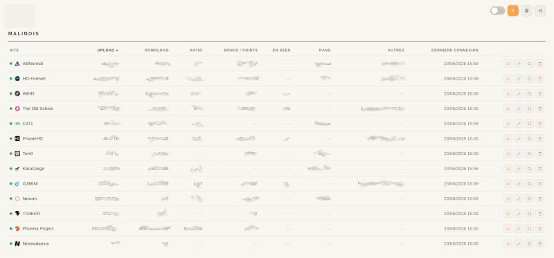
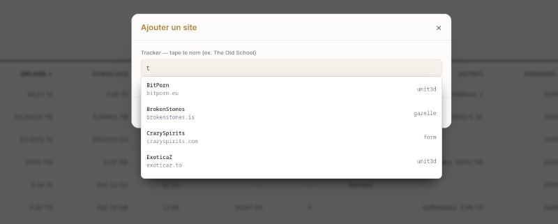
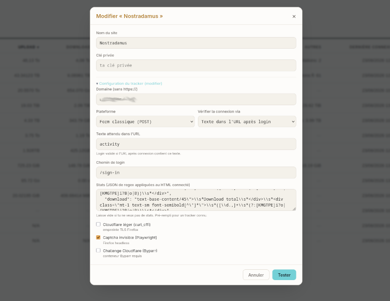
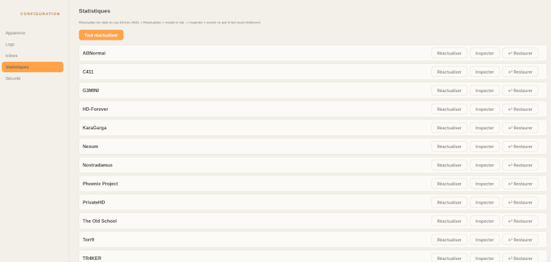
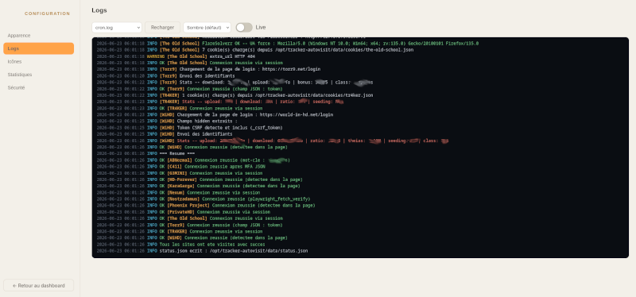

# Malinois

> Tableau de bord web pour l'outil [`tracker-autovisit`](https://github.com/lol-powa/tracker-autovisit) :
> un cron visite chaque tracker privé, extrait les stats par **regex**, et Malinois les
> affiche dans un tableau triable avec un **inspecteur** pour éditer les regex en direct.
>
> Fork : [Gusdezup/Autovisit](https://github.com/Gusdezup/Autovisit) → [lol-powa/tracker-autovisit](https://github.com/lol-powa/tracker-autovisit) → Malinois. La couche dashboard est ajoutée par-dessus l'outil amont.

---

## Aperçu

Le tableau de bord regroupe les stats de tous tes trackers privés sur une seule page :
upload, download, ratio, bonus/points, en seed, rang et dernière connexion. Chaque colonne
est triable et chaque ligne propose des actions rapides (revisite, édition, inspecteur, suppression).



---

## Fonctionnalités

- Agrégation des stats de trackers privés (UNIT3D, Gazelle, formulaires classiques…).
- Trois modes de connexion anti-Cloudflare par site : empreinte TLS Firefox (`curl_cffi`),
  captcha invisible (Playwright headless), challenge complet (Byparr).
- Inspecteur de regex en direct sur un dump du HTML reçu, avec sauvegarde/restauration.
- Authentification (login + 2FA optionnel), thème clair/sombre, icônes par tracker.
- Collecte planifiée par cron, journaux consultables et mode **Live**.
- **Alertes multi-canaux** (e-mail/SMTP, Telegram, ntfy) sur conditions configurables (échec, rétablissement, stats revenues en N/A, récapitulatif), avec un **modèle de message unique** personnalisable (entête / corps / pied de page, émojis, variables `{site}`/`{statut}`/`{stats}`… cliquables).
- **Détection des challenges Cloudflare** : un site qui renvoie une page de défi au lieu de ses stats est marqué **EN ÉCHEC** avec la raison, au lieu d'un faux « OK » aux stats vides.
- **Dashboard auto-rafraîchi** (toutes les 30 s et au retour sur l'onglet) et **purge des journaux** en un clic.

---

## Installation avec Docker (recommandé)

L'image est **générique** : elle s'installe partout où tourne Docker (VM, NAS, bare-metal…),
sans dépendre d'un conteneur LXC. Tous les chemins internes sont fournis par l'image ; seules
les **données** vivent dans un volume monté (`./data`).

> ⚠️ Construis l'image depuis la **racine de ton fork `tracker-autovisit`** : c'est là que vit
> `autovisit.py` (l'outil de collecte), que le `Dockerfile` embarque avec la couche Malinois.

```bash
# Depuis la racine de ton fork tracker-autovisit (qui contient autovisit.py)
cp .env.example .env          # ajuste le port, la TZ, le planning cron si besoin
docker compose up -d --build
```

Le dashboard est ensuite accessible sur `http://localhost:8080` (port configurable via `Malinois_PORT`).

Deux conteneurs sont lancés :

- **`malinois`** : nginx + l'API web + le cron de collecte, dans une seule image.
- **`byparr`** : le solveur Cloudflare. Il partage la pile réseau de `malinois`, donc il reste
  joignable sur `127.0.0.1:8191` — exactement comme l'attendent les configs de site existantes
  (`cf_solver`), sans aucune modification à faire. [FlareSolverr](https://github.com/FlareSolverr/FlareSolverr)
  est interchangeable (même API `/v1`, même port) : soit en surchargeant `BYPARR_IMAGE`, soit via le
  service `flaresolverr` fourni commenté dans le `docker-compose.yml`. Les deux solveurs partageant le
  port 8191, on n'en lance qu'un à la fois.

### Premier lancement

1. Ouvre le dashboard : tant qu'aucun mot de passe n'est défini, l'instance est
   **verrouillée** — un écran « Définir le mot de passe » s'affiche et aucune donnée
   n'est servie tant que tu n'as pas choisi un mot de passe (8 caractères minimum).
   Active ensuite la 2FA si tu veux dans **Configuration → Sécurité**.
2. Ajoute tes trackers (voir ci-dessous) ou restaure ton dossier `data/` existant dans le volume.

> **Sécurité de l'auth.** Le mot de passe est haché (PBKDF2-SHA256, 120 000 itérations,
> sel aléatoire) ; la session est un jeton signé HMAC avec expiration. Changer le mot de
> passe **invalide toutes les autres sessions** (rotation du secret de signature). Le login
> est throttlé (5 échecs en 5 min → temporisation). Le cookie est `HttpOnly; SameSite=Lax`
> (ajoute `Secure` si tu sers en HTTPS derrière un reverse proxy).

### Ajouter un site

Le bouton **+** ouvre la recherche de trackers : tape le nom, Malinois propose les trackers
connus de sa base avec leur plateforme détectée.



### Configurer un tracker

La fiche d'édition règle la connexion (domaine, plateforme, chemin de login, texte attendu dans
l'URL) et surtout le bloc **Stats** : les regex appliquées au HTML de la page d'accueil connectée
pour en extraire les chiffres. C'est ici qu'on choisit le mode anti-Cloudflare du site.

Pour les sites en **cookies de session**, chaque cookie se saisit sur **sa propre ligne (nom + valeur)** — à relever depuis `F12 → Stockage → Cookies` (et non l'onglet *Réseau*, pour éviter la troncature « … »). Pense au cookie « se souvenir » (`remember_*` / `remember_web_*`) en plus du cookie de session, et à `cf_clearance` si le site est derrière Cloudflare.



### Réactualiser et inspecter

Dans **Configuration → Statistiques**, chaque tracker se réactualise individuellement, s'inspecte
(ajustement des regex en direct sur un dump du HTML) ou se restaure à sa dernière sauvegarde.
**Tout réactualiser** relance la collecte sur l'ensemble des sites.



### Logs en direct

L'onglet **Configuration → Logs** affiche `cron.log` (et les autres journaux) dans une console
colorée, avec un mode **Live** pour suivre une collecte en temps réel.



---

## Configuration (variables d'environnement)

Définies dans `.env` (copié depuis `.env.example`) :

| Variable | Défaut | Rôle |
|---|---|---|
| `Malinois_PORT` | `8080` | Port HTTP publié sur l'hôte |
| `TZ` | `Europe/Paris` | Fuseau horaire (cron + Byparr) |
| `CRON_SCHEDULE` | `0 6 * * *` | Planning par défaut de la collecte (modifiable dans l'UI) |
| `BYPARR_IMAGE` | `ghcr.io/thephaseless/byparr:latest` | Image du solveur (FlareSolverr possible) |

---

## Données & sauvegarde

Tout l'état persistant est dans `./data` (monté en volume) :

```
data/
├── sites.d/        # configs des sites (domaines, regex, secrets) — sensible
├── cookies/        # cookies de session
├── logs/           # cron.log, visit_YYYY-MM.log
├── .sitebak/       # sauvegardes auto des configs
├── .statsbak/      # sauvegardes auto des regex (bouton "Restaurer")
├── _webicones/     # icônes custom uploadées via l'UI
├── auth.json       # identifiants du dashboard (auth)
├── status.json     # dernières valeurs extraites
└── settings.json   # réglages du dashboard
```

Pour **sauvegarder**, archive simplement le dossier `data/`. Pour **désactiver l'auth** si tu te
verrouilles dehors :

```bash
docker compose exec malinois rm -f /opt/tracker-autovisit/data/auth.json
docker compose restart malinois
```

> Le `.gitignore` exclut `data/` et `.env` : tes secrets ne partent jamais dans le dépôt.

---

## Installation classique (sans Docker)

L'installeur `deploy-addsite.sh` reste disponible pour une install directe :

```bash
# Sur la machine qui héberge tracker-autovisit (VM, bare-metal, LXC où tu as un shell)
MODE=local CT_IP=192.168.0.50 LAN_CIDR=192.168.0.0/24 ./deploy-addsite.sh

# Ou poussé depuis un hôte Proxmox vers un conteneur LXC
MODE=lxc CT=100 CT_IP=192.168.0.50 LAN_CIDR=192.168.0.0/24 ./deploy-addsite.sh
```

Dans ce mode, nginx/systemd/cron sont configurés directement sur la cible (le filtrage IP par
`LAN_CIDR` y est appliqué). La version Docker, elle, s'appuie sur l'auth applicative + ton pare-feu.

---

## Crédits & remerciements

Malinois est une **surcouche dashboard** : tout le travail de collecte (visite des trackers,
authentification, extraction) revient à l'outil amont. Merci à ses auteurs, sans qui rien de
tout ceci n'existerait.

- **Auteur original** — [Gusdezup/Autovisit](https://github.com/Gusdezup/Autovisit).
- **Fork divergent** — [lol-powa/tracker-autovisit](https://github.com/lol-powa/tracker-autovisit), base de ce projet.
- **Malinois** — couche web ajoutée par-dessus : dashboard, inspecteur de regex, authentification,
  icônes et packaging Docker.

Reporte-toi aux dépôts amont pour la **licence** et les conditions d'utilisation de l'outil de collecte.

Outils tiers utilisés par la collecte : [Byparr](https://github.com/ThePhaseless/Byparr) (ou
[FlareSolverr](https://github.com/FlareSolverr/FlareSolverr)) pour le challenge Cloudflare,
[Playwright](https://playwright.dev/) pour les captchas invisibles.

---

## Structure du dépôt

```
.
├── Dockerfile                 # image autonome (overlay + outil)
├── docker-compose.yml         # malinois + byparr
├── .env.example
├── docker/
│   ├── entrypoint.sh          # prépare le volume, planifie le cron, lance supervisord
│   ├── supervisord.conf       # nginx + web-api + cron
│   ├── nginx.conf             # reverse proxy générique
│   └── requirements.txt       # deps overlay + runtime
├── deploy-addsite.sh          # installeur classique (MODE=local|lxc)
├── api/web-api.py             # backend (gestion sites, réglages, auth, inspecteur)
├── web/{index.html,addsite.js}# dashboard
├── patchers/                  # patches additifs pour autovisit.py
├── tools/                     # render_logos.py, fetch_favicons.py
├── systemd/, nginx/           # unités pour l'install classique
├── data/                      # manifeste logos + cibles favicons (le reste est runtime, ignoré par git)
└── docs/img/                  # captures du README
```
